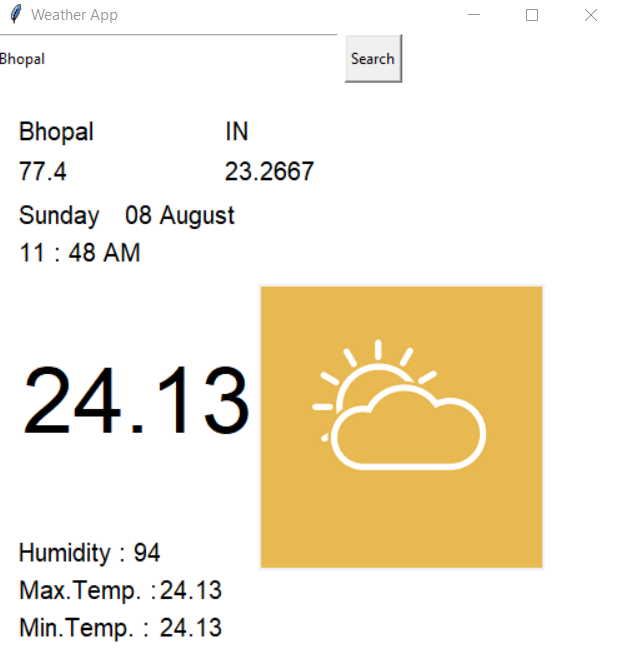

# 📋 WEATHER APPLICATION

## 📌 List is of content
* **Code** Folder Contains all the Source code and images that needed. 
* **Weather.md** Contains All the description, Introduction, Approach of the project. 

## How to run Weather Application❓


* First Frok this repository 

* Create clone your forked repository on your local machine.

For example, run this Command inside your Git bash or terminal:

```

git clone https://github.com/<your-github-username>Weather_App_Using_python.git

````

* Open **Code** Folder in Python IDEs

<br>

###### for exaple,Visual Studio Code, Sublime Text ,Atom etc.

* install Respective Python libraries
 
 **How to install Python libraries❓**

```

pip install tkinter

pip install requests

```

### Then You have to generate Your Own API key
**How To Generate API Key❓**

* Login in the [Open Weather Map](https://openweathermap.org/)

* Go to the API section. 
* Under Api Section go in **Current Weather Data section** click on the API Document

* Now in the API Call section,You have to link Your own api to the code

```

api.openweathermap.org/data/2.5/weather?q={city name}&appid={API key}

```

* Then run the Code

# Output

 


## 📌 This Folder Contains a Markdown File That Explains WEATHER APIs In Python.
### int-py-10 group comprises of three people.
### Rohit Akilaysh Vanne and Rishabh Rathore compiling publishing the content in markdown file.
### Komal Jangra working on video Presentation and Video recording.
### Rohit Akilaysh Vanne handling video editing part.

